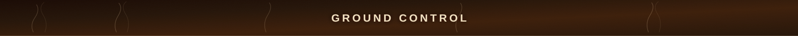
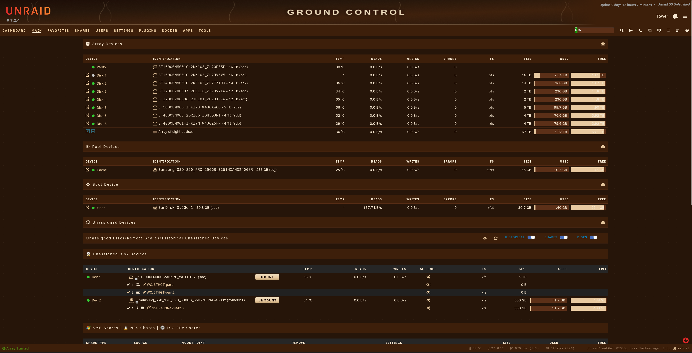

# Ristretto — Unraid Theme

A dark Unraid theme inspired by dark roast coffee. Deep brown canvas, pale crema accents, warm ivory text. Designed for long sessions — rich and warm without the eye strain of cold black-and-white interfaces.

**Companion theme (coming soon):** Crema (light)

---

## Preview

### Dashboard

### Main

### Plugins

### Settings

---

## Install

1. Install the **Simple Custom WebUI CSS** plugin from the Unraid Community Apps.
2. In the Unraid web UI navigate to: **Plugins → Simple Custom WebUI CSS**
3. Paste the contents of `ristretto.css` into the CSS field, or upload the file and reference it.
4. Save — the UI reloads with the Ristretto palette applied.

## Rollback

1. Open the Simple Custom WebUI CSS plugin settings.
2. Clear the CSS field (or disable the plugin).
3. Save — the default theme is restored immediately.

---

## Palette

| Token | Hex | Role |
|---|---|---|
| `--rs-bg` | `#261509` | Page canvas — Dark Drip |
| `--rs-surface` | `#3D1F0A` | Primary surface — cards, panels, headers |
| `--rs-surface-2` | `#4A2510` | Elevated surface — modals, inputs |
| `--rs-border` | `#5C3018` | Standard border |
| `--rs-border-subtle` | `#4A2510` | Subtle border — `
`, dividers |
| `--rs-text-primary` | `#F5E6D0` | Primary text — Warm Ivory |
| `--rs-text-muted` | `#9A7A60` | Secondary text, labels |
| `--rs-text-disabled` | `#7A5C42` | Disabled state |
| `--rs-accent` | `#E8C9A0` | Crema — links, icons, CTAs |
| `--rs-accent-hover` | `#F0DFC0` | Crema hover |
| `--rs-accent-active` | `#C8A878` | Crema active/pressed |
| `--rs-warning` | `#FCD34D` | Warm Yellow — disk warnings |
| `--rs-error` | `#EF4444` | Crimson — critical errors |
| `--gray-400` | `#5C3018 !important` | Dynamix usage bar track override |

---

## Compatibility

- Tested with Unraid **7.2.4**
- Base theme: **Black** (dynamix/themes/black.css)
- Requires: **Simple Custom WebUI CSS** plugin
- No external dependencies — fully self-contained CSS

---

## Architecture

Three-layer CSS custom property system:

- **Layer 1** — all hex values defined once as `--rs-*` semantic tokens
- **Layer 2** — maps every Dynamix CSS variable to an `--rs-*` token (~70 variables across backgrounds, text, borders, buttons, usage bars, dashboard widgets, and more)
- **Layer 3** — selector-level overrides for pseudo-elements, interaction states, and elements Dynamix's variable system cannot reach (scrollbars, focus rings, button gradients, chart backgrounds, header icons)

### Notable overrides

| Area | Fix |
|---|---|
| Header icons (bell, key) | `.text-header-text-primary` Tailwind class overridden — Unraid bakes a fixed colour at build time |
| CPU chart grid | `#cpuchart` background elevated to `--rs-surface-2` for grid line contrast |
| Usage bars | Inset `box-shadow` trick — Dynamix overrides `background-color` after our CSS |
| Button gradients | Multi-stop gradient cannot use `var()` — crema stops documented as exceptions |

---

## Files

| File | Description |
|---|---|
| `ristretto.css` | Full theme — all three layers |
| `ground-control-banner.svg` | 1920×90 SVG banner — dark drip gradient, steam curves, GROUND CONTROL wordmark |
| `ground-control-banner.png` | Rasterised 1920×90 PNG |
| `screenshots/` | Live screenshots from Unraid 7.2.4 |

---

## License

MIT
