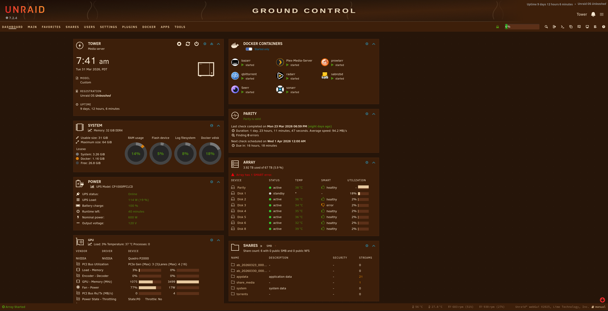
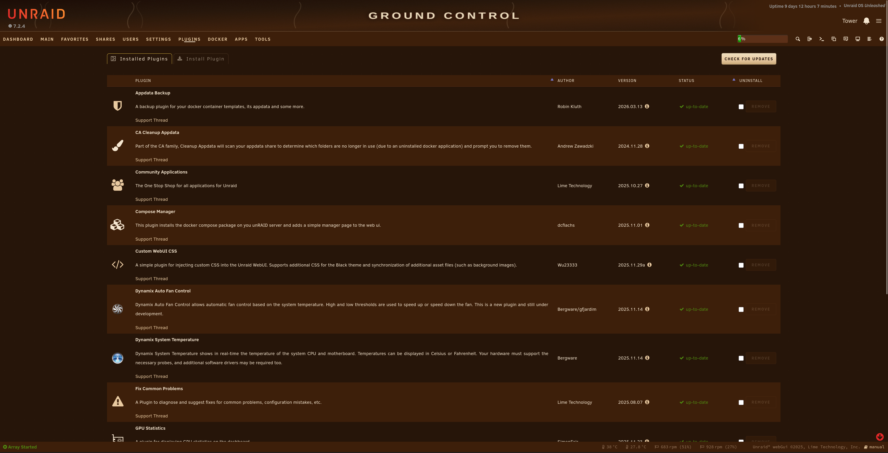
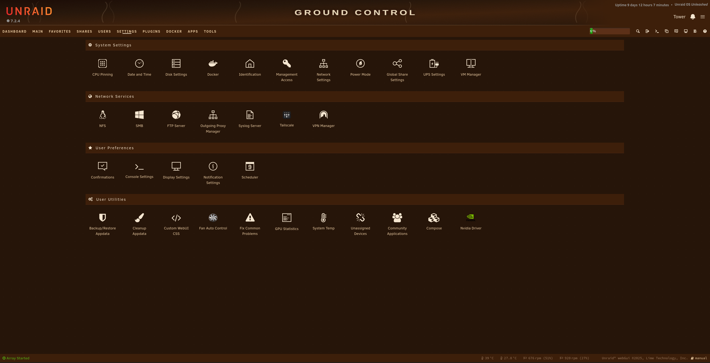

# Ground Control — Unraid Themes

A pair of companion Unraid themes sharing a coffee-house aesthetic and the GROUND CONTROL banner. Warm tones, strong contrast, no cold grays.

| Theme | Mode | Base |
|---|---|---|
| [Ristretto](ristretto/) | Dark | Dynamix Black |
| [Crema](crema/) | Light | Dynamix White |

---

## Ristretto (dark)

Deep brown canvas, pale crema accents, warm ivory text.

| | |
|---|---|
|  |  |
|  |  |

→ [Install & palette](ristretto/README.md)

---

## Crema (light)

Golden cream canvas, espresso text, warm copper accents.

| | |
|---|---|
|  |  |
|  |  |

→ [Install & palette](crema/README.md)

---

## Install (both themes)

1. Install the **Simple Custom WebUI CSS** plugin from Unraid Community Apps.
2. Paste the contents of your chosen theme's `.css` file into the CSS field.
3. Save — the UI reloads immediately.

Full instructions in each theme's README.

---

## License

MIT
