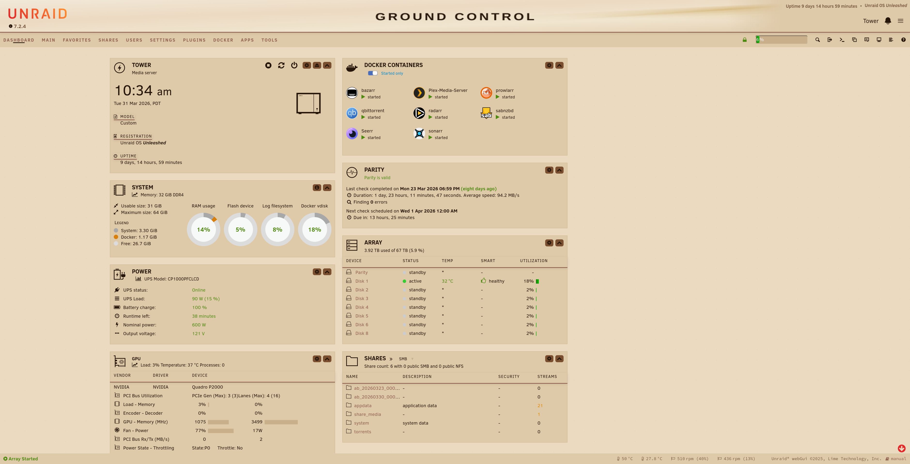
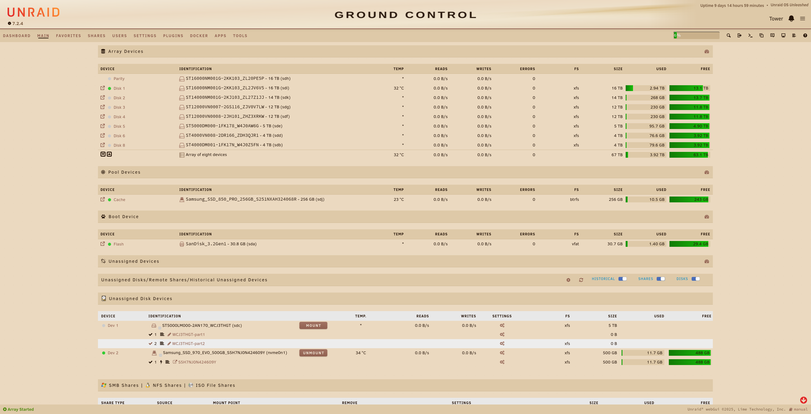
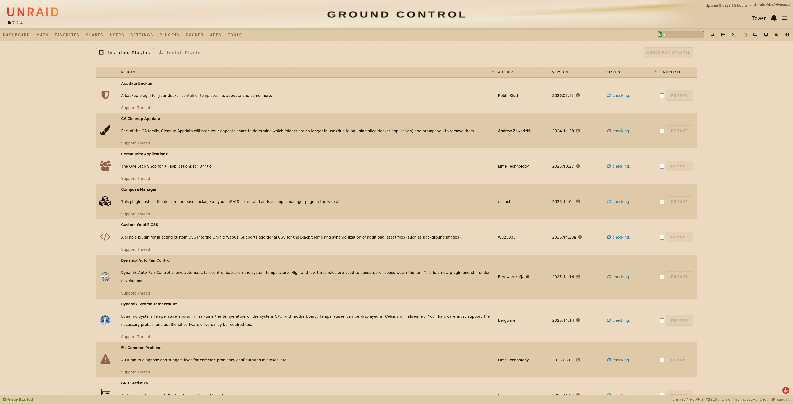
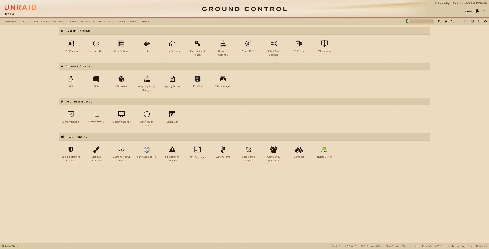

# Crema — Unraid Light Theme

Warm morning-cafe aesthetic for Unraid 7.x. Sunlight through a cafe window: golden cream canvas, espresso text, warm copper accents. Companion to [Ristretto](../ristretto) (dark).

**Base theme:** Dynamix White
**Tested with:** Unraid 7.2.4

---

## Preview


### Dashboard


### Main


### Plugins


### Settings


---

## Install

1. Install the **Simple Custom WebUI CSS** plugin from the Unraid Community Apps.
2. In the Unraid web UI navigate to: **Plugins → Simple Custom WebUI CSS**
3. Paste the contents of `crema.css` into the CSS field, or upload the file and reference it.
4. Save — the UI reloads with the Crema palette applied.

### Banner (optional)

Copy `ground-control-banner-light.png` to:
```
/boot/config/plugins/dynamix/themes/banner.png
```
Then set the banner path in Display Settings.

## Rollback

1. Open the Simple Custom WebUI CSS plugin settings.
2. Clear the CSS field (or disable the plugin).
3. Save — the default theme is restored immediately.

---

## Palette

| Token | Hex | Role |
|---|---|---|
| `--cr-bg` | `#EBD9C0` | Page canvas |
| `--cr-surface` | `#DEC9A8` | Cards, panels, header, footer |
| `--cr-surface-2` | `#CDB899` | Modals, focused inputs |
| `--cr-surface-highlight` | `#F5EDE0` | Focused card, hovered tile |
| `--cr-border` | `#C9B08A` | Separators, input outlines |
| `--cr-border-subtle` | `#DEC9A8` | Subtle dividers |
| `--cr-text-primary` | `#261509` | Primary text |
| `--cr-text-muted` | `#7A5C42` | Labels, nav, footer meta |
| `--cr-text-disabled` | `#9A7A60` | Disabled state |
| `--cr-accent` | `#906050` | Links, CTAs, nav active |
| `--cr-accent-hover` | `#7A4F30` | Hover state |
| `--cr-accent-active` | `#6B4830` | Pressed state |
| `--cr-warning` | `#7A3600` | Disk temp, low space |
| `--cr-error` | `#8B1A1A` | Disk fault, parity error |

---

## Architecture

Three-layer CSS custom property system:

- **Layer 1** — all hex values defined once as `--cr-*` semantic tokens
- **Layer 2** — maps every Dynamix CSS variable to a `--cr-*` token (~70 variables)
- **Layer 3** — selector-level overrides for pseudo-elements, interaction states, and elements the Dynamix variable system cannot reach (scrollbars, focus rings, button gradients, header icons, dashboard controls)

### Notable overrides

| Area | Fix |
|---|---|
| Header icons (bell, key) | `.text-header-text-primary` Tailwind class overridden — Unraid bakes a fixed colour at build time |
| Button icon contrast | Icons inside buttons inherit cream text colour — prevents copper-on-copper bleed |
| Dashboard controls | `.control.openclose` chevrons forced to espresso for legibility on warm surface |
| Usage bars | `--gray-400` remapped to `--cr-border` for warm tone alignment |

---

## Files

| File | Description |
|---|---|
| `crema.css` | Full theme — all three layers |
| `ground-control-banner-light.svg` | 1920×90 SVG banner — morning light rays, GROUND CONTROL wordmark |
| `ground-control-banner-light.png` | Rasterised 1920×90 PNG |
| `screenshots/` | Live screenshots from Unraid 7.2.4 |

---

## Notes

- Targets **Dynamix White** base theme. For dark, use [Ristretto](../ristretto).
- `--cr-accent` on elevated surfaces (`--cr-surface-2`) falls back to `--cr-accent-hover` for interactive elements — WCAG AA compliance on elevated backgrounds.
- Accent, warning, and error tokens were darkened from initial spec values to pass WCAG AA contrast requirements.
- No external resources — fully self-contained CSS.

---

## License

MIT
